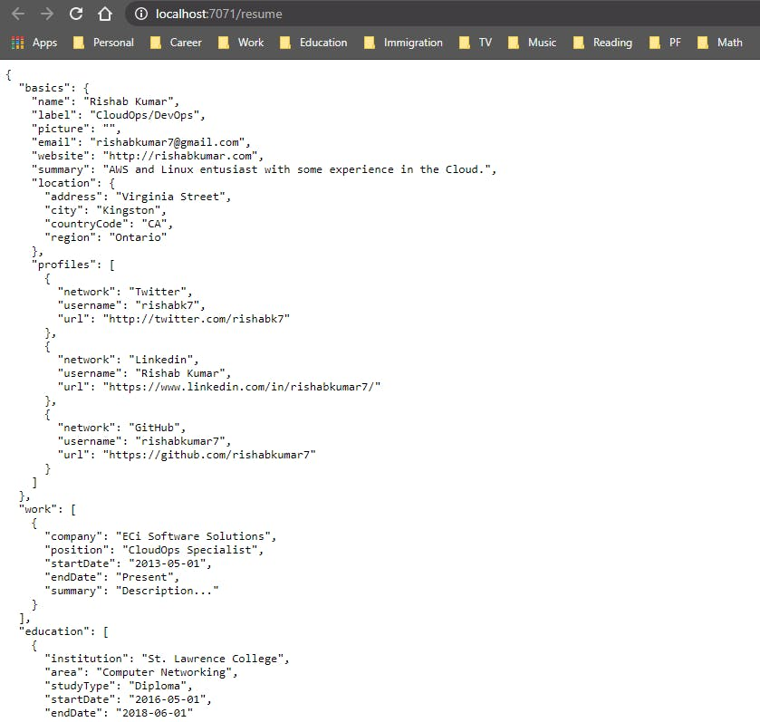
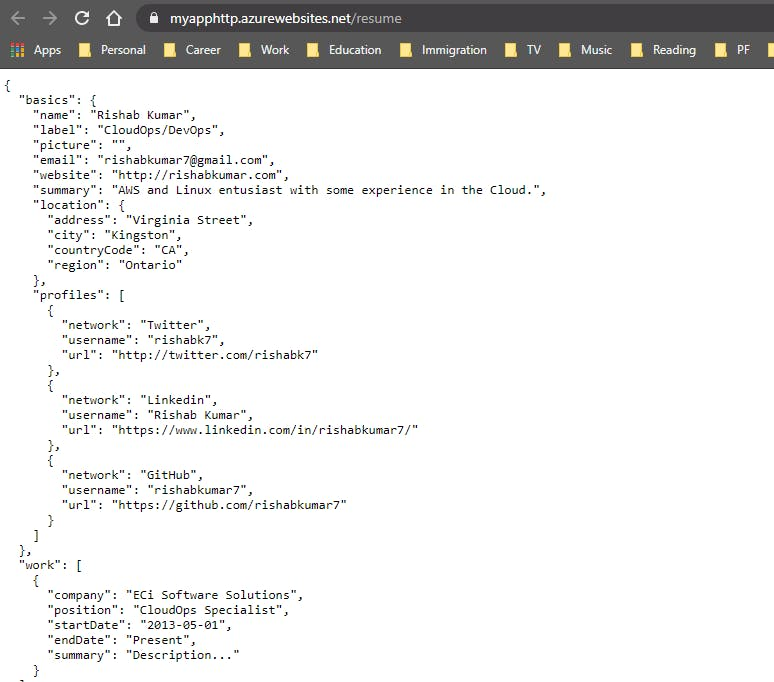
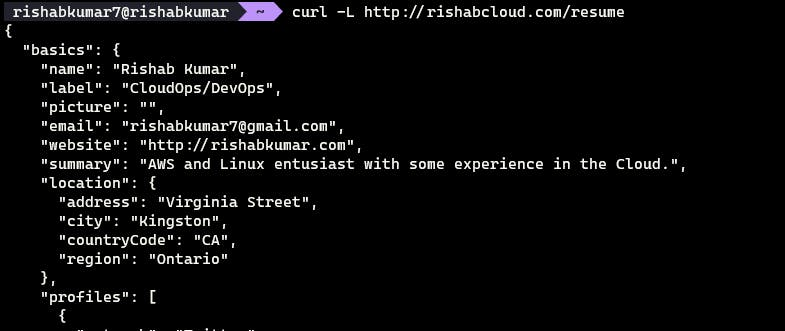

# ResumeAPI w/ Azure Functions
Resume API challenge with Azure Functions

## Introduction 📑
I've been inspired by the Cloud Resume Challenge by Forest Brazeal to build more stuff in the cloud. I wanted to build something simple to continue my Cloud journey. I decided to build an open-source REST API for my JSON-based standard format resume. I'm using JavaScript and Azure Functions.

## Technologies ⚙
- Azure Functions

## Languages

- [x] Python
- [x] JavaScript
- [ ] CSharp

## Let's get going 🚀
As part of the #ServerlessSeptember, I submited my project as an article for the event and you can reference to my article here in order to get started with the Resume API.
I used this [Resume JSON Schema](https://jsonresume.org/schema/) to create my resume in JSON format.

<a href="https://blog.rishabkumar.com/how-i-built-a-resume-api-with-javascript-and-azure-functions-ckesofyvt00grkls17pir3qd9"></a>
## Submit your API endpoint
 - Please fork this repo
 - Edit the ResumeEndpoints.md
 - Submit a PR
 - Show it off on your resume.


## How to create a function using Azure Functions CLI
- [Install the Azure Functions Core Tools](https://docs.microsoft.com/en-us/azure/azure-functions/functions-run-local?tabs=v4%2Cwindows%2Ccsharp%2Cportal%2Cbash%2Ckeda)

In Azure Functions, a function project is a container for one or more individual functions that each responds to a specific trigger. All functions in a project share the same local and hosting configurations. In this section, you create a function project that contains a single function.

Run the func init command, as follows, to create a functions project in a folder named LocalFunctionProj with the specified runtime:
`func init LocalFunctionProj --javascript`

Let's navigate into the project folder:
`cd LocalFunctionProj`

This folder contains various files for the project, including configurations files named local.settings.json and host.json. Because local.settings.json can contain secrets downloaded from Azure, the file is excluded from source control by default in the .gitignore file.

Add a function to your project by using the following command, where the --name argument is the unique name of your function (resume) and the --template argument specifies the function's trigger (HTTP).
`func new --name resume --template "HTTP trigger"`

`func new` creates a subfolder matching the function name that contains a code file appropriate to the project's chosen language and a configuration file named function.json.

-`index.js` exports a function that's triggered according to the configuration in `function.json.`

```
module.exports = async function (context, req) {
    context.log('JavaScript HTTP trigger function processed a request.');

    const name = (req.query.name || (req.body && req.body.name));
    const responseMessage = name
        ? "Hello, " + name + ". This HTTP triggered function executed successfully."
        : "This HTTP triggered function executed successfully. Pass a name in the query string or in the request body for a personalized response.";

    context.res = {
        // status: 200, /* Defaults to 200 */
        body: responseMessage
    };
}
```
Now we will edit the index.js so that it responds with our JSON resume. We will have our resume JSON in the jsonData as followings:
```
module.exports = function(context, req) {
    jsonData = {
	    "basics": {
		      "name": "Rishab Kumar",
		      "label": "CloudOps/DevOps",
		      "picture": "",
		      "email": "rishabkumar7@gmail.com",
		      "website": "http://rishabkumar.com",
		      "summary": "AWS and Linux entusiast with some experience in the Cloud.",
		      "location": {
			      "city": "Kingston",
			      "countryCode": "CA",
			      "region": "Ontario"
		    },
		  "profiles": [{
				  "network": "Twitter",
				  "username": "rishabk7",
				  "url": "http://twitter.com/rishabk7"
			  },
			  {
				  "network": "Linkedin",
				  "username": "Rishab Kumar",
				  "url": "https://www.linkedin.com/in/rishabkumar7/"
			  },
			  {
				  "network": "GitHub",
				  "username": "rishabkumar7",
				  "url": "https://github.com/rishabkumar7"
			  }
		  ]
	    },
	    "work": [{
		    "company": "ECi Software Solutions",
		    "position": "CloudOps Specialist",
		    "startDate": "2013-05-01",
		    "endDate": "Present"
	    }],
	    "education": [{
		    "institution": "St. Lawrence College",
		    "area": "Computer Networking",
		    "studyType": "Diploma",
		    "startDate": "2016-05-01",
		    "endDate": "2018-06-01"
	    }],
	    "awards": [{
			    "title": "AWS Certified Developer Associate",
			    "date": "2017-11-01"
		    },
		    {
		      "title": "AWS Certified Soultions Architect Associate",
			    "date": "2017-11-01"
		    },
		    {
			    "title": "AWS Certified Cloud Practitioner",
			    "date": "2017-11-01"
		    },
		    {
		    	"title": "Microsoft Certified Azure Fundamentals",
			    "date": "2017-11-01"
		    },
		    {
			    "title": "OCI Foundatios 2020 Certified Associate",
			    "date": "2017-11-01"
		    }
	   ]
  }

    context.res = {
       body: JSON.stringify(jsonData, null, 2)
    };
    context.done();
};
```
For an HTTP trigger, the function receives request data in the variable req as defined in function.json. The return object, defined as $return in function.json, is the response.

- `function.json` is a configuration file that defines the input and output bindings for the function, including the trigger type.
```
{
    "bindings": [
        {
            "authLevel": "anonymous",
            "type": "httpTrigger",
            "direction": "in",
            "name": "req",
            "methods": [
                "get",
                "post"
            ]
        },
        {
            "type": "http",
            "direction": "out",
            "name": "res"
        }
    ]
}
```

Note: By default the authLevel is set to function, we will change that to anonymous so that anyone can access our Resume.
Each binding requires a direction, a type, and a unique name. The HTTP trigger has an input binding of type httpTrigger and output binding of type http.

### Run the function locally
Run your function by starting the local Azure Functions runtime host from the LocalFunctionProj folder: func start Toward the end of the output, the following lines should appear:
```
...

Now listening on: http://0.0.0.0:7071
Application started. Press Ctrl+C to shut down.

Http Functions:

        HttpExample: [GET,POST] http://localhost:7071/api/resume
...
```
Copy the URL of your resume function from this output to a browser, the full URL like localhost:7071/api/resume. The browser should display a message like:


In order to get rid of the `/api/` in the `http://localhost:7071/api/resume/`, you can do the following in the `host.json` file: Add the routePrefix property:
```
{
  "version": "2.0",
  "logging": {
    "applicationInsights": {
      "samplingSettings": {
        "isEnabled": true,
        "excludedTypes": "Request"
      }
    }
  },
  "extensions": {
    "http": {
        "routePrefix": ""
    }
  },
  "extensionBundle": {
    "id": "Microsoft.Azure.Functions.ExtensionBundle",
    "version": "[1.*, 2.0.0)"
  }
}
```
The terminal in which you started your project also shows log output as you make requests. When you're ready, use `Ctrl+C` and choose `y` to stop the functions host.

### Create supporting Azure resources for your function

Before you can deploy your function code to Azure, you need to create three resources:

- A resource group, which is a logical container for related resources.
- A Storage account, which maintains state and other information about your projects.
- A function app, which provides the environment for executing your function code. A function app maps to your local function project and lets you group functions as a logical unit for easier management, deployment, and sharing of resources.

Use the following Azure CLI commands to create these items. Each command provides JSON output upon completion.

If you haven't done so already, sign in to Azure with the az login command:
```
az login
```
Create a resource group with the az group create command. The following example creates a resource group named `AzureFunctionsQuickstart-rg` in the `westeurope` region. (You generally create your resource group and resources in a region near you, using an available region from the `az account list-locations` command.)
```
az group create --name AzureFunctionsQuickstart-rg --location westeurope
```
Create a general-purpose storage account in your resource group and region by using the `az storage account create` command. In the following example, replace `<STORAGE_NAME>` with a globally unique name appropriate to you. Names must contain three to 24 characters numbers and lowercase letters only. `Standard_LRS` specifies a general-purpose account, which is supported by Functions.
```
az storage account create --name <STORAGE_NAME> --location westeurope --resource-group AzureFunctionsQuickstart-rg --sku Standard_LRS
```
The storage account incurs only a few cents (USD) for this quickstart.

Create the function app using the `az functionapp create` command. In the following example, replace `<STORAGE_NAME>` with the name of the account you used in the previous step, and replace `<APP_NAME>` with a globally unique name appropriate to you. The `<APP_NAME>` is also the default DNS domain for the function app.

```
az functionapp create --resource-group AzureFunctionsQuickstart-rg --consumption-plan-location westeurope --runtime node --runtime-version 10 --functions-version 2 --name <APP_NAME> --storage-account <STORAGE_NAME>
```

### Deploy the function project to Azure

With the necessary resources in place, you're now ready to deploy your local functions project to the function app in Azure by using the `func azure functionapp publish` command. In the following example, replace `<APP_NAME>` with the name of your app.
```
func azure functionapp publish <APP_NAME>
```
If you see the error, "Can't find app with name ...", wait a few seconds and try again, as Azure may not have fully initialized the app after the previous `az functionapp create command`.

The publish command shows results similar to the following output (truncated for simplicity):
```
Getting site publishing info...
Creating archive for current directory...
Performing remote build for functions project.

...

Upload completed successfully.
Deployment completed successfully.
Syncing triggers...
Functions in myapphttp:
    resume - [httpTrigger]
        Invoke url: https://myapphttp.azurewebsites.net/resume
```

### Invoke the function on Azure

Because your function uses an HTTP trigger, you invoke it by making an HTTP request to its URL in the browser or with a tool like curl. In both instances, the code URL parameter is your unique function key that authorizes the invocation of your function endpoint.

Copy the complete Invoke URL shown in the output of the publish command into a browser address bar, .The browser should display a similar output as when you ran the function locally.



Curl



We did it 😍, now we have our Resume up and running, we can set custom domains in the Azure UI.